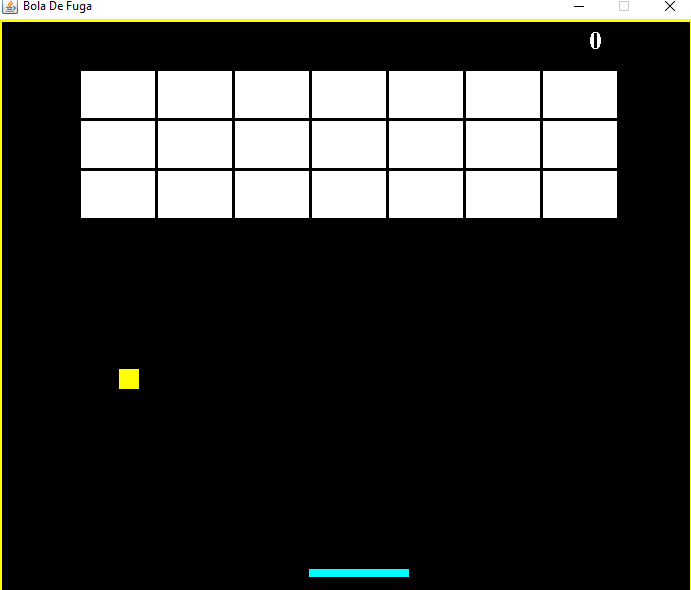

# quebra-de-tijolos

## Tela de introdução do jogo que consiste em direcionar a bola com a paleta pra que quebre os blocos caso contrário game-over

## Jogo iniciado em que a bola vai atingindo os blocos e agrupando pontos até o fim dos blocos

